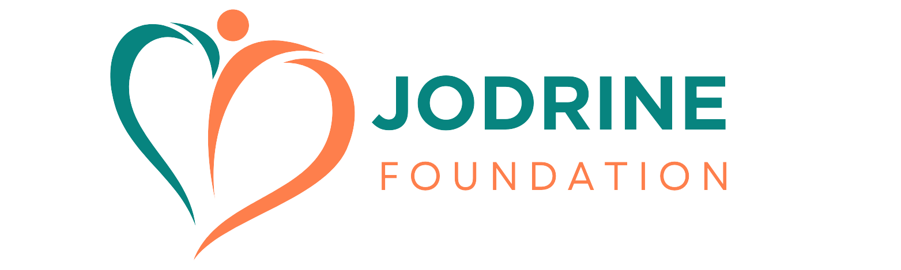

## ABOUT US 
Jodrine Foundation is a non-profit organization dedicated to transforming lives through education and healthcare initiatives in Mukusu Gomba Village, Uganda. Our mission is to empower the community and create sustainable solutions for long-term development.

## KEY INITIATIVES
- **Education:** We operate Jodrine Junior School, providing quality education to children in the village.
- **Healthcare Outreach:** Our healthcare programs aim to improve access to medical services and promote wellness in the community.
- **Clean Water Projects:** We're working to provide clean and accessible water sources to reduce waterborne diseases and improve sanitation.
- **Community Development:** We're committed to fostering economic empowerment and sustainable development in Mukusu Gomba.

## HOW TO GET INVOLVED
1. **Donate:** Your financial support helps us fund our projects and make a lasting impact on the lives of those in need. Visit our website [jodrinefoundation.org](https://www.jodrinefoundation.org) to contribute.
2. **Volunteer:** Join us as a volunteer and get involved in our programs. Contact us at [jodrinefoundation@gmail.com](mailto:jodrinefoundation@gmail.com) to learn more.
3. **Spread the Word:** Follow us on social media and share our mission with your friends and family to help raise awareness.

## LET'S TALK
- **Email:** jodrinefoundation@gmail.com
- **Address:** Mukusu Gomba, UGANDA

Thank you for your support in making a difference with Jodrine Foundation!

